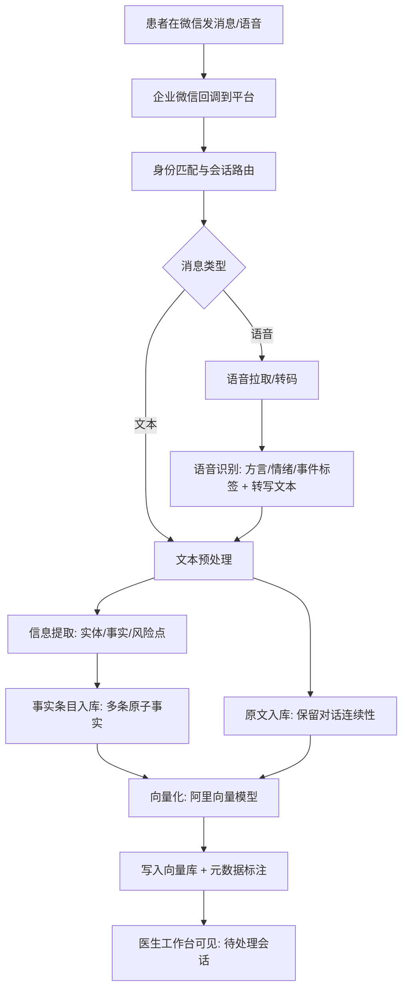
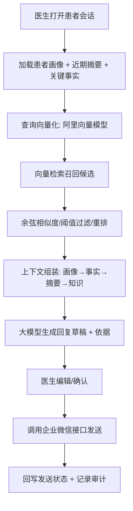

# 医疗智能助手（企业微信视角）技术介绍

## 1. 项目定位与形态

本项目是网站形态的医疗智能辅助平台，面向企业微信场景进行设计与集成：
- 患者端通过微信向企业微信发消息
- 医生端通过网站平台管理会话并调用企业微信接口发送消息
- 平台负责对话归档、知识检索、医生辅助、质控审计等能力

## 2. 系统架构与集成边界

### 2.1 总体结构
- 网站平台负责业务管理、智能推理与数据治理
- 企业微信负责消息入口与发送通道
- 智能模型提供意图识别、知识检索与回复草稿生成

### 2.2 关键系统组件
- 前端应用：医生工作台、患者档案、知识库与质控管理
- 后端业务：会话路由、身份与权限、消息编排、模型调用
- 企业微信集成：回调接入、客户消息发送、素材与模板管理
- 数据层：云数据库与对象存储，不依赖本地数据库文件

### 2.3 核心交互链路
- 患者消息：微信 → 企业微信 → 平台回调 → 业务处理 → 网站工作台
- 医生回复：网站操作 → 平台发送指令 → 企业微信接口 → 患者微信

## 3. 业务流程（企业微信视角）

### 3.1 患者发消息流程
1. 患者在微信中向企业微信发起消息
2. 企业微信回调消息到平台接口
3. 平台完成身份匹配与会话归档
4. 平台进行意图识别与上下文检索
5. 结果在医生工作台展示为待处理会话

### 3.2 医生回复流程
1. 医生在网站工作台查看对话与患者资料
2. 平台生成智能回复草稿与参考依据
3. 医生确认或编辑后发送
4. 平台调用企业微信接口将消息发送给患者
5. 发送状态回写，形成闭环记录

### 3.3 资料导入与画像更新
1. 医生在平台导入既往病历或随访资料
2. 平台抽取关键事实并结构化归档
3. 画像更新与长期记忆沉淀
4. 画像参与后续检索与回复生成

## 4. 平台核心功能（技术与实现）

### 4.1 会话管理与消息编排
- 多患者并发会话管理，按患者、时间与标签检索
- 消息多通道统一入库，支持图片、文件与结构化消息
- 消息状态跟踪，包含送达、已读与失败重试

### 4.2 患者档案与权限控制
- 结构化档案管理，包含基础信息、病史、过敏史与随访记录
- 严格权限控制，按角色与科室进行数据隔离
- 全链路审计记录，支持回溯与合规检查

### 4.3 智能对话与知识增强
- 意图识别区分病情咨询、行政问答、泛咨询
- 检索增强生成，提高专业性与一致性
- 支持多知识域覆盖，包括诊疗规范与院内流程

### 4.3.1 模型能力与职责划分
- 大模型负责意图识别、摘要归纳、医生回复草稿生成与多轮对话理解
- 向量模型指定采用阿里系向量模型（例如 Qwen3-Embedding 通过阿里云百炼/模型服务调用），用于将文本转为向量并进行语义检索
- 两者协作形成“先检索、后生成”的增强式回复流程

### 4.3.2 检索增强生成（RAG）详细过程
RAG 的目标是让回复建立在“可追溯的知识与患者上下文”之上，而不是只依赖大模型的参数记忆。典型流程如下：
1. 预处理：对用户输入进行清洗与标准化（去冗余、统一单位/时间表达、同义词归一等）
2. 信息提取：先从输入中提取关键实体与事实（症状、持续时间、用药、过敏史、检查结果等），用于结构化沉淀与画像更新
3. 向量化：分别对“用户问题”“结构化事实”“候选知识条目/历史记忆”进行向量化
4. 召回：从向量库中按语义相似度召回候选集合（例如取 TopK=50 的候选）
5. 重排与过滤：基于阈值、元数据过滤、去重与时间衰减等策略筛选高相关片段（例如只保留相似度大于阈值的条目）
6. 上下文组装：将筛选后的片段按“患者画像 → 关键事实 → 历史对话摘要 → 业务/医学知识”的顺序拼装为上下文
7. 生成草稿：将上下文注入提示词，调用大模型生成医生回复草稿与可引用依据
8. 审核发送：医生确认/修改后发送；平台记录最终回复、引用证据与发送状态，便于质控与复盘

### 4.3.3 用户信息提取与结构化入库
为避免“只存原文，后续检索噪声大”的问题，平台对每次输入采用“原文 + 事实条目”双轨入库：
- 原文入库：保留用户原始表述，便于还原语境与对话连续性
- 事实入库：将输入拆分为多条原子事实（例如“头痛三天”“伴随恶心”“既往高血压”“对青霉素过敏”），每条事实单独向量化、单独写入 RAG 记忆库
- 元数据标注：为每条入库内容补充元数据（患者标识、时间、来源类型、科室、情绪标签、方言标签、可信度等），用于后续过滤与质控

### 4.3.4 用户画像自动识别与更新
平台为每位患者维护一份“动态画像”，用于提升多轮对话一致性与个性化医疗沟通：
- 画像输入：患者基础档案 + 历史事实条目 + 近期对话摘要 + 风险标签（例如慢病、过敏、妊娠、精神心理风险等）
- 画像输出：结构化摘要（既往史/过敏史/常见症状/用药偏好/沟通偏好/依从性）+ 非结构化总结（便于直接注入提示词）
- 更新策略：新消息到来时先做事实提取，再对画像进行增量更新；对冲突信息进行“标记待确认”而非直接覆盖
- 质控要求：画像更新需保留可追溯来源（来自哪条事实/哪次导入），便于医生核对与纠错

### 4.6 语音识别（方言）与情绪识别
- 语音入口：患者可通过企业微信发送语音消息，平台在回调中接收并拉取语音文件
- 语音识别：采用阿里系语音识别能力，支持普通话与多方言识别，并输出可用于后续处理的文本转写结果
- 情绪与事件识别：在转写的同时输出情绪标签与音频事件标签（例如哭泣、笑声、咳嗽等），用于驱动下游回复策略（安抚、降级、陪伴、严肃告知等）
- 提示词注入：将“方言类型 + 情绪标签 + 音频事件”作为结构化上下文注入大模型输入，指导生成更贴近用户状态的回复草稿

### 4.6.1 阿里语音大模型（SenseVoice）能力概览
参考《阿里语音大模型研究报告》，语音能力不再仅是“语音转文字”，而是一次性输出“转写文本 + 方言识别 + 情绪识别 + 音频事件检测”的结构化结果：
- 端到端推理：采用非自回归端到端架构，面向低延迟实时交互
- 大规模训练：通过超大规模语音数据训练，覆盖多语言与复杂声学环境，提升嘈杂、远场、口音场景鲁棒性
- 多任务一体化：同一条语音可同步产出转写结果、语言/方言标签、情绪标签、背景事件标签，便于直接进入业务编排

### 4.6.2 方言识别（自动语种识别，LID）
在企业微信场景下，患者语音可能天然携带方言特征。语音模型可开启自动识别模式（例如设置 LID 为 auto），输出方言/语种标签并用于后续“语言风格适配”：
- 覆盖范围：可覆盖主要官话方言与粤语、吴语、闽南话、湘/赣等方言体系（具体以部署的模型版本与服务能力为准）
- 业务价值：在强情绪（悲伤/愤怒）下，用户更可能回归方言表达；识别出方言后，可在医生草稿生成阶段做“方言风格适配”，增强亲和力与安抚效果

### 4.6.3 情绪识别（SER）与音频事件检测（AED）
语音情绪识别与事件检测用于“决定怎么说”，而不只是“说了什么”。研究报告给出了典型的离散情绪标签与事件标签示例：
- 情绪标签示例：快乐、悲伤、愤怒、中性、恐惧、厌恶、惊讶
- 事件标签示例：哭泣、笑声、咳嗽、喷嚏、背景音乐等
- 业务策略示例：
  - 检测到“悲伤 + 哭泣”时，优先触发高优先级安抚与风险关注提示
  - 检测到“愤怒”时，优先触发降级话术（先共情与承担、再给方案），避免直接解释或辩解
  - 检测到“咳嗽/喷嚏”等事件时，可提示医生关注呼吸道相关症状并追问关键信息

### 4.6.4 输出结构与工程解析（后处理与提示词注入）
为实现“语音模型 → 业务编排 → 大模型生成”的无缝衔接，建议在语音识别之后增加一个“后处理中间层”，负责把语音结果变成可控、可审计的结构化上下文：
- 典型输出内容：
  - 转写文本（用于入库与检索）
  - 时间戳（用于对齐关键片段与回放定位）
  - 置信度（用于质控与二次确认策略）
  - 标签（方言、情绪、事件）
- 后处理中间层职责：
  - 从语音输出中提取情绪与事件标签，生成统一的情绪上下文对象（例如“主情绪、强度、是否伴随哭泣”等）
  - 将“方言类型 + 情绪上下文 + 事件标签”注入到大模型输入中，作为生成策略的重要条件
  - 将上述结构化结果与原始语音/转写的关联关系落库，支撑后续审计、复盘与质控

### 4.6.5 低延迟实时链路建议（语音到草稿）
面向实时交互与医生高频处理，建议采用流式与并发编排思路（参考研究报告的工程建议）：
- 语音截断：前端或网关侧采用语音活动检测，尽早判断一句话结束
- 异步并发：一旦产出初步转写，立即并发触发“向量检索召回”“安抚提示词模板加载”等；音频尾部事件可继续补充
- 预取策略：若在句子前段检测到强烈愤怒等信号，可提前预加载相应提示词与知识过滤条件
- 流式输出：大模型生成可采用流式推送，医生工作台先看到草稿骨架，再逐步补全细节，提高体感速度

### 4.6.6 隐私安全与合规要点（语音与情绪数据）
语音与情绪数据属于高敏数据，建议按研究报告中的合规要点进行约束：
- 生物特征风险：语音可能包含声纹等生物特征信息，语音文件应最小化保留，完成处理后及时销毁或做严格加密与访问控制
- 情绪数据敏感性：情绪标签属于敏感个人信息范畴，需最小化存储、按需可见、严格审计；用于模型迭代时应做匿名化与权限隔离

### 4.4 医生辅助与提效
- 自动生成回复草稿并提供关键信息提示
- 标注来源依据，方便医生快速核对
- 诊后随访与提醒自动化

### 4.5 质控与运营分析
- 关键指标统计：响应时长、处理量、满意度
- 风险提示与合规词库检测
- 运营看板支持团队协同管理

## 5. 数据体系与存储设计

### 5.1 数据类型
- 用户与会话数据：患者档案、对话记录、会话状态
- 业务数据：知识库、模板、医生操作与审计日志
- 智能数据：向量索引、画像总结与检索结果

### 5.2 存储方案建议
- 业务数据库：采用云端关系型数据库以满足高并发与强一致（如 MySQL 或 PostgreSQL）
- 向量检索：采用向量数据库或检索引擎向量能力（如 Milvus、pgvector、Elasticsearch 向量检索）
- 文件与素材：使用对象存储管理图像、附件与导入资料
- 缓存与队列：使用缓存与消息队列提升吞吐与稳定性

### 5.2.1 向量检索与余弦相似度计算
- 文本向量化：将用户问题、知识条目、历史记忆转换为向量表示
- 相似度计算：对查询向量与候选向量进行余弦相似度计算，核心公式为：相似度 = 点积 /（向量模长相乘）
- 工程优化：向量入库时可预先做归一化（单位向量），检索时将点积作为相似度近似，从而减少重复的开方计算
- 排序与截断：按相似度降序排序，取前几条作为检索上下文
- 回答生成：将检索上下文与对话内容输入大模型生成回复草稿

### 5.2.2 余弦相似度的计算步骤（工程视角）
假设查询向量为 q，候选向量为 v，维度为 d：
1. 点积：dot = Σ(i=1..d) q[i] * v[i]
2. 模长：|q| = sqrt(Σ q[i]^2)，|v| = sqrt(Σ v[i]^2)
3. 余弦相似度：score = dot / (|q| * |v|)
4. 归一化优化：若入库时已将向量归一化为单位向量，则 score ≈ dot，可大幅降低计算开销

### 5.2.3 匹配过程与策略细节
为避免“低相关内容被错误召回”与“相似度虚高”的问题，匹配过程通常包含以下控制点：
- 候选分层：知识库（规则/科普/院内流程）与患者记忆（事实/摘要）分开召回，再合并重排
- 阈值过滤：对相似度设置最低阈值，低于阈值的候选不进入上下文，防止无关知识污染生成
- 去重与覆盖：对高度相似的候选做去重，控制上下文长度，把窗口留给更丰富的信息
- 时间衰减：对“患者记忆”引入时间权重，近期事实优先，避免旧信息长期主导
- 元数据过滤：结合科室、话题域、情绪标签进行过滤，提高召回的场景匹配度

### 5.2.4 RAG入库与索引的字段建议
为支撑“可过滤、可审计、可回溯”，向量库中的每条记录建议至少包含以下字段：
- 业务主键：record_id（唯一标识）
- 患者维度：patient_id（患者标识）、conversation_id（会话标识，可选）
- 内容维度：content（文本）、content_type（原文/事实/摘要/知识条目）、source（来源：对话/导入/运营配置）
- 检索维度：embedding（向量）、embedding_model（向量模型标识）、embedding_dim（维度）
- 场景标签：domain（诊疗/行政/随访等）、dept（科室）、language（语言）、dialect（方言）
- 情绪标签：emotion（情绪标签）、audio_events（音频事件标签，可选）
- 质量控制：confidence（识别/抽取置信度）、verified（是否已被医生确认）
- 时序字段：created_at（写入时间）、occurred_at（事件发生时间）

### 5.2.5 阈值与TopK的推荐做法
阈值与TopK并不存在“一刀切”的最佳值，建议按数据域分别配置并可灰度调整：
- 知识库检索：TopK 较大用于召回（例如 30~100），再用阈值与重排压缩到少量高质量片段
- 患者记忆检索：更偏向近期事实与高相关事实，TopK 可更小（例如 10~50），并引入时间衰减
- 阈值策略：可从“保守阈值 + 少量片段”起步，观察误召回（无关内容）与漏召回（缺少关键依据）后再调优
  
### 5.2.6 用户画像（Persona）字段示例
用户画像建议同时维护“结构化字段”和“可直接注入提示词的摘要”，并保留来源与可信度：
- 结构化字段：既往史、过敏史、慢病标签、近期症状列表、常用药、禁忌、随访计划、沟通偏好、依从性评估
- 摘要字段：一段可读的画像总结，用于直接注入到大模型提示词中
- 变更记录：每次更新记录“新增/修正/待确认”的条目及来源（来自哪次对话或哪份导入资料）

## 8. 业务逻辑流程图（核心链路）

### 8.1 患者消息入站与RAG入库

### 8.2 医生侧辅助生成与发送闭环

### 5.3 数据合规
- 数据分级与脱敏策略
- 访问日志与操作审计
- 数据保留与删除策略配置

## 6. 企业微信对接要点

### 6.1 接入能力
- 消息回调接入与验签
- 客服消息与群发能力
- 素材与模板管理
- 语音消息：语音文件拉取、转码与识别任务编排

### 6.2 安全与可靠性
- 回调重试与幂等处理
- 消息发送失败降级与补偿
- 接口限流与告警机制

## 7. 运行与部署说明

### 7.1 部署形态
- 采用容器化部署，网站平台与消息接入服务可独立扩展
- 支持多环境配置与灰度发布

### 7.2 配置要点
- 企业微信的回调地址与凭证配置
- 模型服务密钥与安全存储
- 数据库、向量检索与对象存储连接信息
